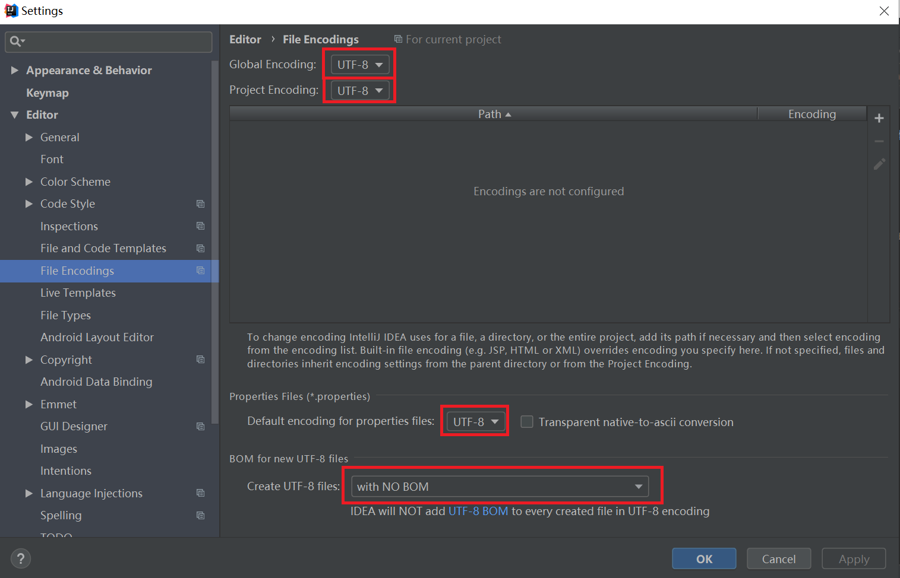
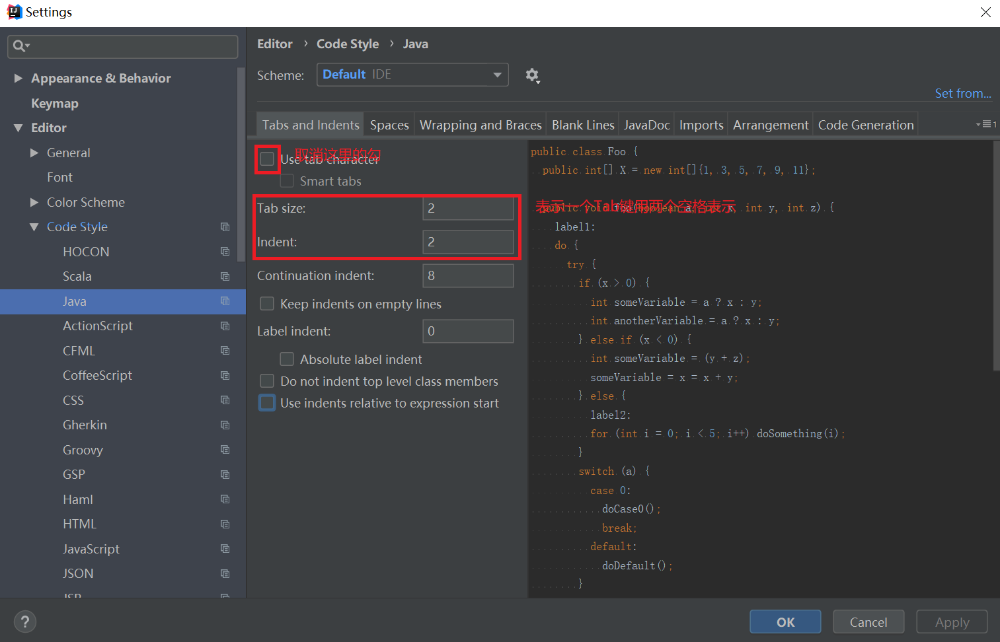
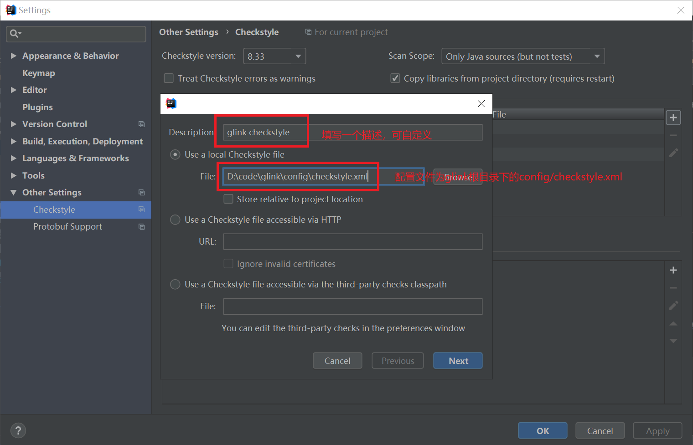
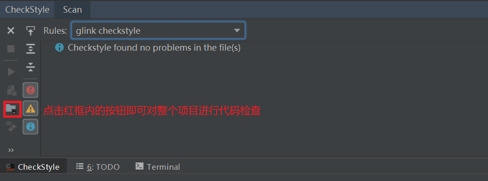

# 开发流程及规范说明
由于是多人项目, 且是从零开始构建. 因此在开发过程中应当尽可能符合通用规范. 以便大家可以更好地互相理解对方代码. 本文档
对一些常见的规范予以说明, 希望大家遵守.

## 开发环境

### IDE
开发IDE推荐 IntelliJ IDEA, 建议尽量不要使用其他IDE. 在开发之前, **强制**要求进行以下配置, 避免在跨平台环境下出现难以理解
的Bug.

#### 文件编码
所有的文件编码统一为UTF-8, 一般Mac和Linux环境下默认为UTF-8, Windows下特别注意, 但建议在任何环境下开发之前都确定如下配置.
 

    

#### 文件格式
项目采用了Checkstyle对代码进行严格的规范检查, 代码文件中不允许存在Tab(即\t)符号, 所有需要用到空白的地方一律用空格, 所有
代码缩进两个空格, 为此可在IDEA中进行如下配置.
 

    

#### Checkstyle代码检查
项目采用Checkstyle检查代码格式, 以规范大家的代码编写. 请首先在IDEA中安装Checkstyle插件, 插件安装如有问题请上网搜索. 
安装完成后进行如下配置, 使用项目统一的规范检查代码格式.
 

    

配置完成后, 可用如下方法运行检查.
 

    

## 代码Commit

1. master分支上尽量不要随意提交自己的测试代码, 例如熟悉Flink环境的WordCount代码.
2. 每个人都可以建立自己的dev分支, 建议用Nickname-dev命名, 自己的dev分支上可以运行任何你想要的测试代码. dev分支也可以push
    到远程.
3. master分支上的commit尽量使用详细的说明, 采用以下几种情况:
    + 新增功能: 以大写ADD FEATURE开头, 例如增加空间范围查询功能的提交为: ADD FEATURE spatial range query
    + Bug修订: 以大写FIX开头, 例如修订空间范围查询算法中的Bug: FIX spatial range query algorithm bug

## 代码规范

1. 建议大致阅读一下《阿里巴巴Java开发手册》, 基本遵循这一规则, 可以安装相关[插件](https://yq.aliyun.com/articles/224817)
2. 代码注释尽量全面, 尽量用英文写, 如果实在用英文难以表述清楚也不必勉强, 可用中文描述, 但是注意不要采用中文标点符号,
    即使用中文写注释也使用英文标点符号.

# 学习资源
为方便大家快速入门, 方便相互之间的交流, 相关的学习资源都已经整理在百度网盘上. 
链接：[https://pan.baidu.com/s/1djwsHcHXCTI91tN3Eia0qA](https://pan.baidu.com/s/1djwsHcHXCTI91tN3Eia0qA) 
提取码：kliv